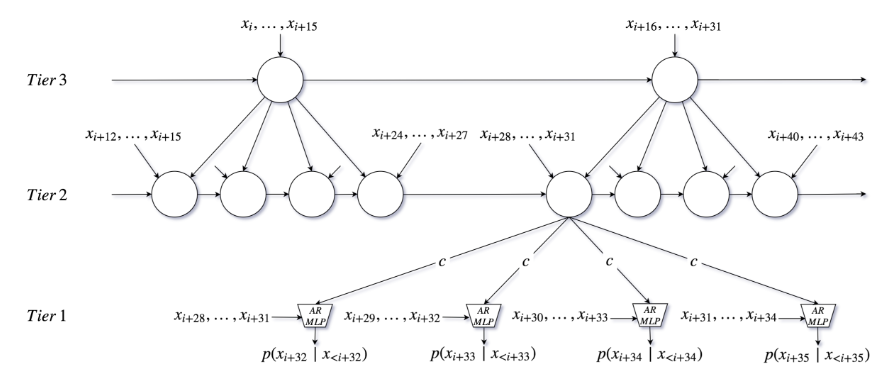

# samplernn-pytorch

[SampleRNN:无条件端到端神经音频生成模型]的PyTorch实现(https://arxiv.org/abs/1612.07837).



基础代码请参考https://github.com/deepsound-project/samplernn-pytorch（使用的pytorch版本较老，在30系列上无法搭建正确的gpu环境来跑，所以修改了大量代码适配比较新的pytorch）

## Dependencies

可以通过运行“pip install-r requirements.txt”来安装部分依赖项。（原始requirement.txt中有些依赖需要替换为较新的）

## Datasets

构建数据集：需要先安装ffmpeg和youtube-dl ,然后运行以下指令
```
cd datasets
./download-from-youtube.sh "https://www.youtube.com/watch?v=EhO_MrRfftU" 8 piano
```

可以自己准备数据集：“datasets/”中的一个目录，放置等长的wav文件。也可以通过子类化`torch.utils.data.dataset`创建自己的数据集格式。可参考FolderDataset

## Training
在命令行训练模型（也可直接修改train.py中的默认参数值进行训练）：
```
python train.py --exp TEST --frame_sizes 16 4 --n_rnn 2 --dataset piano
```
结果-训练日志、损失图、模型检查点和生成的样本将保存在“results/”中。

## result 
目前的情况是代码可正常run，但生成的音频连波形都没有，后续会持续找问题，如果大家有修改建议或讨论，我将非常感谢！
                                                    